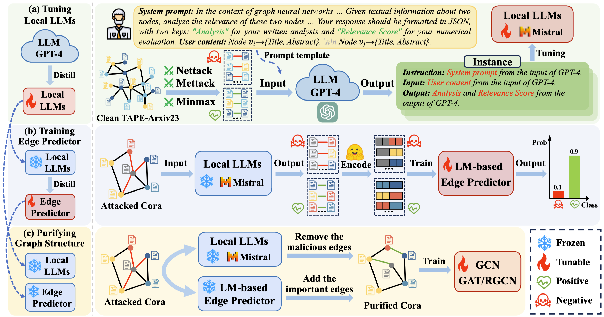

# LLM4RGNN

[](https://arxiv.org/abs/2408.08685)
[](https://opensource.org/licenses/MIT)

Official implementation for KDD 2025 paper: "**[Can Large Language Models Improve the Adversarial Robustness of Graph Neural Networks?](https://arxiv.org/pdf/2408.08685)**"



## Table of Contents

- [1. Overview](#1-overview)
- [2. Installation](#2-installation)
- [3. Code Structure](#3-code-structure)
- [4. Datasets](#4-datasets)
- [5. Large Language Models](#5-large-language-models)
- [6. Experiments](#6-experiments)
- [7. Scaling to Large Graphs](#7-scaling-to-large-graphs)
- [8. Hyperparameters](#8-hyperparameters)
- [9. Citation](#9-citation)

## 1. Overview

LLM4RGNN is a novel framework for enhancing the adversarial robustness of Graph Neural Networks (GNNs) using Large Language Models (LLMs). The framework distills the inference capabilities of GPT-4 into a local LLM for identifying malicious edges and an LM-based edge predictor for finding missing important edges, so as to recover a robust graph structure.

## 2. Installation

### System Requirements

- OS: Linux Ubuntu 5.15.0-102-generic
- CPU: Intel(R) Xeon(R) Platinum 8358 CPU @ 2.60GHz
- GPU: NVIDIA A800 80GB

### Setup Environment

Create and activate a conda environment with the required packages:

```bash
# Create conda environment
conda create -n llm4rgnn python=3.12
conda activate llm4rgnn

# Install dependencies
pip install -r requirements.txt
```

## 3. Code Structure

```
LLM4RGNN/
├── dataset                 # Directory for storing all datasets
│   ├── arxiv               # OGBN-Arxiv dataset
│   ├── citeseer            # Citeseer dataset
│   ├── cora                # Cora dataset
│   ├── product             # OGBN-Products dataset
│   └── pubmed              # PubMed dataset
├── llm_response            # Directory for storing LLM responses
│   └── mistral-7b-merge    # Responses from well-tuned Mistral-7B
│       ├── all             # All edge prediction results
│       ├── clean           # Predictions for clean graph
│       ├── global          # Predictions for attacked graph
│       └── negative        # Predictions for negative samples
├── saved_model             # Directory for storing model files and results
│   ├── attack              # Attacked graph structures under different perturbation rates
│   │   └── global          # Global attack structures (Meta, DICE)
│   ├── clean               # Clean graph structures
│   ├── candidate_node      # Candidate nodes for potential edges
│   ├── llm                 # LLM model files
│   ├── negative_edge       # Negative edge samples
│   ├── node_emb            # Node embedding vectors
│   │   └── sbert           # SBERT-based node text embeddings
│   └── purify              # Purified graph structures
│       ├── clean           # Purified structures for clean graphs
│       └── global          # Purified structures for attacked graphs
└── src                     # Source code directory
    ├── LLaMA-Factory       # LLM tuning framework
    ├── model               # Model implementations
    ├── script              # Running scripts
    ├── util                # Utility functions
    └── vllm                # vLLM for efficient inference
        ├── instruction     # Instructions for vLLM
        └── output          # vLLM inference outputs
```

## 4. Datasets

### Data Sources

We use the following datasets, all available under MIT license:

- **Cora, Pubmed, OGBN-Arxiv**: [TAPE Repository](https://github.com/XiaoxinHe/TAPE)
- **Citeseer**: [Graph-LLM Repository](https://github.com/CurryTang/Graph-LLM)
- **OGBN-Products**: [LLM-Structured-Data Repository](https://github.com/TRAIS-Lab/LLM-Structured-Data)

### Dataset Statistics

| Dataset | #Nodes | #Edges | #Classes | #Features | Method |
|:-------:|:------:|:------:|:--------:|:---------:|:------:|
| Cora | 2,708 | 5,429 | 7 | 1,433 | BoW |
| Citeseer | 3,186 | 4,225 | 6 | 3,113 | BoW |
| PubMed | 19,717 | 44,338 | 3 | 500 | TF-IDF |
| OGBN-Arxiv | 169,343 | 1,166,243 | 40 | 128 | skip-gram |
| OGBN-Arxiv (subset) | 14,167 | 33,520 | 40 | 128 | skip-gram |
| OGBN-Products (subset) | 12,394 | 29,676 | 47 | 100 | BoW |

### Download Instructions

For convenience, we provide pre-processed datasets with integrated textual and graph information:

1. **Large Datasets** (OGBN-Arxiv, OGBN-Products, PubMed):
   - [Download Link](https://drive.google.com/file/d/1GcZuuEIY8g4xgd6KWsglLjNnIveVLmLQ/view?usp=sharing)

2. **Small Datasets** (Cora, Citeseer):
   - [Download Link](https://drive.google.com/file/d/18byQN6O8FXOsUanbTGbqE0uJjzQeZcyf/view?usp=sharing)

Place the downloaded files in the corresponding subdirectories under the `dataset/` directory.

## 5. Large Language Models

### Model Selection

LLM4RGNN is a general framework compatible with different LLMs. We use Mistral-7B as the representative 7B-scale LLM in our experiments.

- **Base Model**: [Mistral-7B-Instruct-v0.1](https://huggingface.co/mistralai/Mistral-7B-Instruct-v0.1)
- **Fine-tuned Model**: [DreamCode/LLM4RGNN](https://huggingface.co/DreamCode/LLM4RGNN) (our tuned version)

### Fine-tuning the Model

We provide the instruction dataset for fine-tuning, which includes GPT-4's assessments of 26,518 edges:

1. Download the [instruction dataset](https://drive.google.com/file/d/1Ozhp5DStT0Tx1pzFpfU3ZW4oacQIt5HN/view?usp=sharing)
2. Place it at `LLM4RGNN/src/LLaMA-Factory/data/train.jsonl`
3. Run the fine-tuning script:

```bash
bash LLM4RGNN/src/LLaMA-Factory/instruct_tuning.sh
```

> **Note**: For fine-tuning, we recommend creating a separate conda environment compatible with [LLaMA-Factory](https://github.com/hiyouga/LLaMA-Factory/blob/main/requirements.txt).

### Using Pre-tuned Models

We also provide the Mistral-7B LoRA adapters in `LLM4RGNN/saved_model/llm/mistral-7b-lora`. To merge the LoRA adapters with the base model:

```bash
bash LLM4RGNN/src/LLaMA-Factory/merge.sh
```

> **Important**: You need to specify the original LLM path by modifying the "model_name_or_path" parameter in both `instruct_tuning.sh` and `merge.sh`.

### Pre-computed Results

If you want to skip the inference step, we provide all inference results from our experiments:
- [Download Inference Results](https://drive.google.com/file/d/1IqQ2pHot54AL1ykXMIsoFy3CqwNTCRsa/view?usp=sharing)

## 6. Experiments

### Step 1: Create LLM Inference Files

First, generate instruction files for LLM inference on attacked graph structures and negative samples:

```bash
python LLM4RGNN/src/script/create_instruction.py
```

### Step 2: Run LLM Inference

Add the inference file to `LLM4RGNN/src/LLaMA-Factory/data/dataset_info.json` and run inference using the fine-tuned LLM:

```bash
bash LLM4RGNN/src/LLaMA-Factory/inference.sh
```

### Step 3: Purify and Evaluate

Purify the attacked graph structure and evaluate GNN performance:

```bash
python src/LLM/script/run.py
```

## 7. Scaling to Large Graphs

For large-scale graphs like OGBN-Arxiv (169,343 nodes, 1,166,243 edges), we use the parallel inference framework vLLM to improve efficiency:

```bash
bash LLM4RGNN/src/vllm/vllm_inference.sh
```

This approach caches LLM inference results to make the process more efficient for large graphs.

## 8. Hyperparameters

We tune the following key hyperparameters:

- **Local LLM**: 
  - Purification Threshold ($\beta$): 
  - - Clean: {1, 2} (to prevent deleting too many edges)
  - - Attck: {2, 3, 4}

- **LM-based Edge Predictor**:
  - Confidence threshold ($\gamma$): {0.91, 0.93, 0.95, 0.97, 0.99}
  - Number of edges to add ($K$): {1, 3, 5, 7, 9}

## 9. Citation

If you find this work useful, please consider starring 🌟 this repo and citing 📑 our paper:

```bibtex
@article{zhang2024llm4rgnn,
  title={Can Large Language Models Improve the Adversarial Robustness of Graph Neural Networks?},
  author={Zhang, Zhongjian and Wang, Xiao and Zhou, Huichi and Yu, Yue and Zhang, Mengmei and Yang, Cheng and Shi, Chuan},
  journal={arXiv preprint arXiv:2408.08685},
  year={2024}
}
```
